# Entity-relationship diagram

Generated by `python manage.py generate_erd` from the Django models - do not edit by hand. Every table also has `id` (UUID), `created_at` and `updated_at`; tenant tables carry `organisation_id` and are protected by PostgreSQL row-level security.

## Accounts (`accounts`)

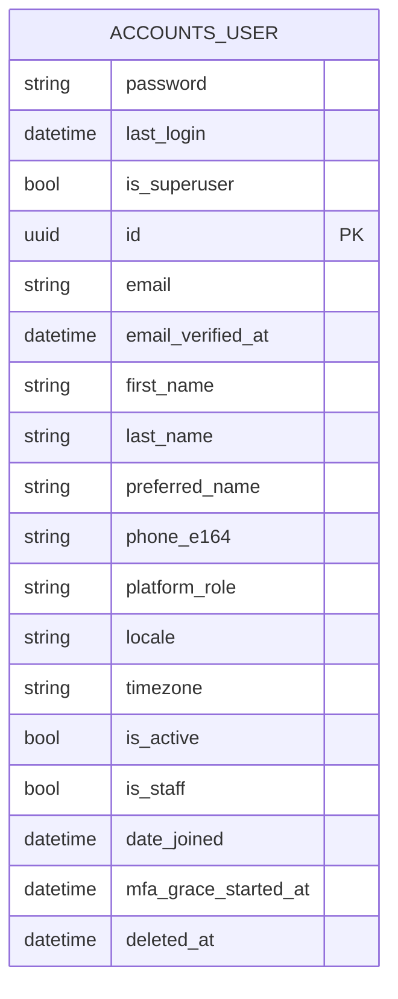
```mermaid
erDiagram
    ACCOUNTS_USER {
        string password
        datetime last_login
        bool is_superuser
        uuid id PK
        string email
        datetime email_verified_at
        string first_name
        string last_name
        string preferred_name
        string phone_e164
        string platform_role
        string locale
        string timezone
        bool is_active
        bool is_staff
        datetime date_joined
        datetime mfa_grace_started_at
        datetime deleted_at
    }
```

## Recruitment analytics (`analytics`)

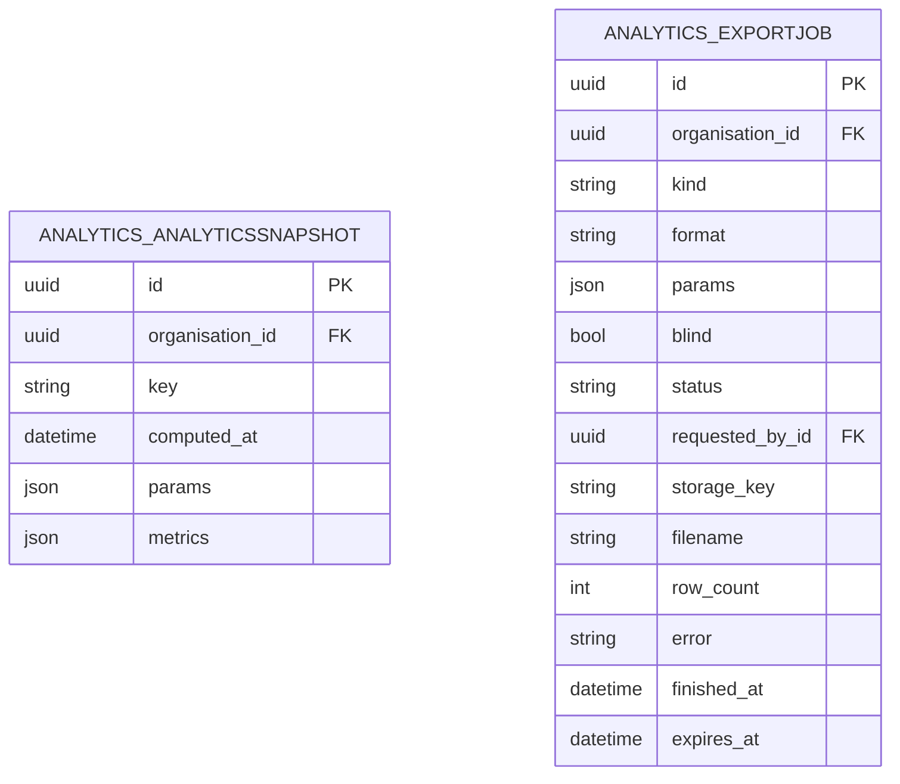
```mermaid
erDiagram
    ANALYTICS_ANALYTICSSNAPSHOT {
        uuid id PK
        uuid organisation_id FK
        string key
        datetime computed_at
        json params
        json metrics
    }
    ANALYTICS_EXPORTJOB {
        uuid id PK
        uuid organisation_id FK
        string kind
        string format
        json params
        bool blind
        string status
        uuid requested_by_id FK
        string storage_key
        string filename
        int row_count
        string error
        datetime finished_at
        datetime expires_at
    }
```

## Applications (`applications`)

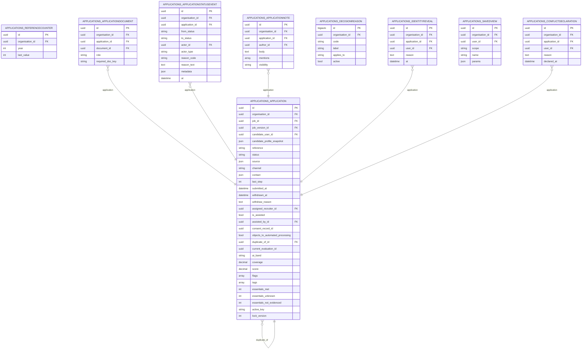
```mermaid
erDiagram
    APPLICATIONS_APPLICATION {
        uuid id PK
        uuid organisation_id FK
        uuid job_id FK
        uuid job_version_id FK
        uuid candidate_user_id FK
        json candidate_profile_snapshot
        string reference
        string status
        json source
        string channel
        json contact
        int last_step
        datetime submitted_at
        datetime withdrawn_at
        text withdraw_reason
        uuid assigned_recruiter_id FK
        bool is_assisted
        uuid assisted_by_id FK
        uuid consent_record_id
        bool objects_to_automated_processing
        uuid duplicate_of_id FK
        uuid current_evaluation_id
        string ai_band
        decimal coverage
        decimal score
        array flags
        array tags
        int essentials_met
        int essentials_unknown
        int essentials_not_evidenced
        string active_key
        int lock_version
    }
    APPLICATIONS_REFERENCECOUNTER {
        uuid id PK
        uuid organisation_id FK
        int year
        int last_value
    }
    APPLICATIONS_APPLICATIONDOCUMENT {
        uuid id PK
        uuid organisation_id FK
        uuid application_id FK
        uuid document_id FK
        string role
        string required_doc_key
    }
    APPLICATIONS_APPLICATIONSTATUSEVENT {
        uuid id PK
        uuid organisation_id FK
        uuid application_id FK
        string from_status
        string to_status
        uuid actor_id FK
        string actor_type
        string reason_code
        text reason_text
        json metadata
        datetime at
    }
    APPLICATIONS_APPLICATIONNOTE {
        uuid id PK
        uuid organisation_id FK
        uuid application_id FK
        uuid author_id FK
        text body
        array mentions
        string visibility
    }
    APPLICATIONS_DECISIONREASON {
        bigauto id PK
        uuid organisation_id FK
        string code
        string label
        string applies_to
        bool active
    }
    APPLICATIONS_IDENTITYREVEAL {
        uuid id PK
        uuid organisation_id FK
        uuid application_id FK
        uuid user_id FK
        text reason
        datetime at
    }
    APPLICATIONS_SAVEDVIEW {
        uuid id PK
        uuid organisation_id FK
        uuid user_id FK
        string scope
        string name
        json params
    }
    APPLICATIONS_CONFLICTDECLARATION {
        uuid id PK
        uuid organisation_id FK
        uuid application_id FK
        uuid user_id FK
        text reason
        datetime declared_at
    }
    APPLICATIONS_APPLICATION }o--|| APPLICATIONS_APPLICATION : "duplicate_of"
    APPLICATIONS_APPLICATIONDOCUMENT }o--|| APPLICATIONS_APPLICATION : "application"
    APPLICATIONS_APPLICATIONSTATUSEVENT }o--|| APPLICATIONS_APPLICATION : "application"
    APPLICATIONS_APPLICATIONNOTE }o--|| APPLICATIONS_APPLICATION : "application"
    APPLICATIONS_IDENTITYREVEAL }o--|| APPLICATIONS_APPLICATION : "application"
    APPLICATIONS_CONFLICTDECLARATION }o--|| APPLICATIONS_APPLICATION : "application"
```

## Audit (`audit`)

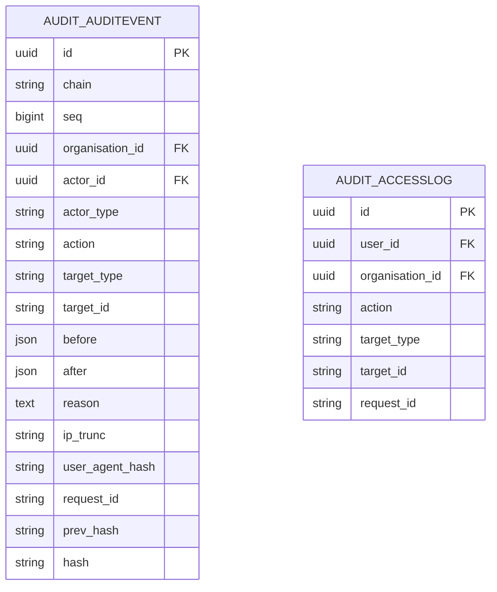
```mermaid
erDiagram
    AUDIT_AUDITEVENT {
        uuid id PK
        string chain
        bigint seq
        uuid organisation_id FK
        uuid actor_id FK
        string actor_type
        string action
        string target_type
        string target_id
        json before
        json after
        text reason
        string ip_trunc
        string user_agent_hash
        string request_id
        string prev_hash
        string hash
    }
    AUDIT_ACCESSLOG {
        uuid id PK
        uuid user_id FK
        uuid organisation_id FK
        string action
        string target_type
        string target_id
        string request_id
    }
```

## Subscriptions and billing (`billing`)

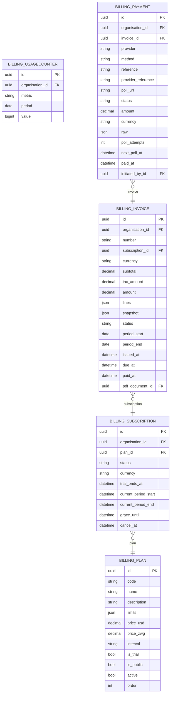
```mermaid
erDiagram
    BILLING_PLAN {
        uuid id PK
        string code
        string name
        string description
        json limits
        decimal price_usd
        decimal price_zwg
        string interval
        bool is_trial
        bool is_public
        bool active
        int order
    }
    BILLING_SUBSCRIPTION {
        uuid id PK
        uuid organisation_id FK
        uuid plan_id FK
        string status
        string currency
        datetime trial_ends_at
        datetime current_period_start
        datetime current_period_end
        datetime grace_until
        datetime cancel_at
    }
    BILLING_USAGECOUNTER {
        uuid id PK
        uuid organisation_id FK
        string metric
        date period
        bigint value
    }
    BILLING_INVOICE {
        uuid id PK
        uuid organisation_id FK
        string number
        uuid subscription_id FK
        string currency
        decimal subtotal
        decimal tax_amount
        decimal amount
        json lines
        json snapshot
        string status
        date period_start
        date period_end
        datetime issued_at
        datetime due_at
        datetime paid_at
        uuid pdf_document_id FK
    }
    BILLING_PAYMENT {
        uuid id PK
        uuid organisation_id FK
        uuid invoice_id FK
        string provider
        string method
        string reference
        string provider_reference
        string poll_url
        string status
        decimal amount
        string currency
        json raw
        int poll_attempts
        datetime next_poll_at
        datetime paid_at
        uuid initiated_by_id FK
    }
    BILLING_SUBSCRIPTION }o--|| BILLING_PLAN : "plan"
    BILLING_INVOICE }o--|| BILLING_SUBSCRIPTION : "subscription"
    BILLING_PAYMENT }o--|| BILLING_INVOICE : "invoice"
```

## Candidates (`candidates`)

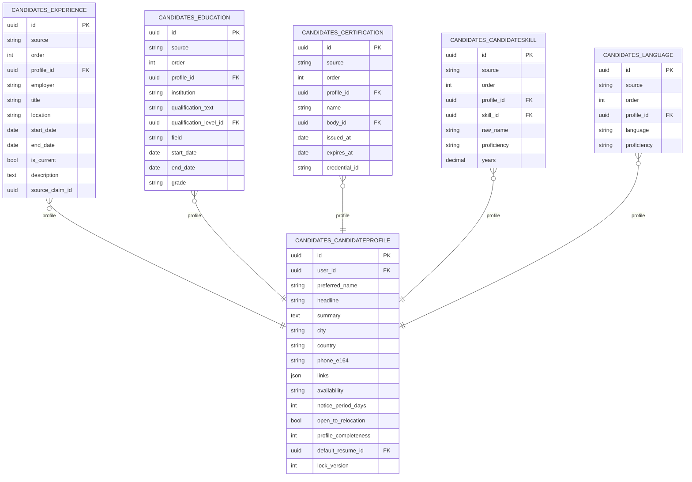
```mermaid
erDiagram
    CANDIDATES_CANDIDATEPROFILE {
        uuid id PK
        uuid user_id FK
        string preferred_name
        string headline
        text summary
        string city
        string country
        string phone_e164
        json links
        string availability
        int notice_period_days
        bool open_to_relocation
        int profile_completeness
        uuid default_resume_id FK
        int lock_version
    }
    CANDIDATES_EXPERIENCE {
        uuid id PK
        string source
        int order
        uuid profile_id FK
        string employer
        string title
        string location
        date start_date
        date end_date
        bool is_current
        text description
        uuid source_claim_id
    }
    CANDIDATES_EDUCATION {
        uuid id PK
        string source
        int order
        uuid profile_id FK
        string institution
        string qualification_text
        uuid qualification_level_id FK
        string field
        date start_date
        date end_date
        string grade
    }
    CANDIDATES_CERTIFICATION {
        uuid id PK
        string source
        int order
        uuid profile_id FK
        string name
        uuid body_id FK
        date issued_at
        date expires_at
        string credential_id
    }
    CANDIDATES_CANDIDATESKILL {
        uuid id PK
        string source
        int order
        uuid profile_id FK
        uuid skill_id FK
        string raw_name
        string proficiency
        decimal years
    }
    CANDIDATES_LANGUAGE {
        uuid id PK
        string source
        int order
        uuid profile_id FK
        string language
        string proficiency
    }
    CANDIDATES_EXPERIENCE }o--|| CANDIDATES_CANDIDATEPROFILE : "profile"
    CANDIDATES_EDUCATION }o--|| CANDIDATES_CANDIDATEPROFILE : "profile"
    CANDIDATES_CERTIFICATION }o--|| CANDIDATES_CANDIDATEPROFILE : "profile"
    CANDIDATES_CANDIDATESKILL }o--|| CANDIDATES_CANDIDATEPROFILE : "profile"
    CANDIDATES_LANGUAGE }o--|| CANDIDATES_CANDIDATEPROFILE : "profile"
```

## Core platform (`core`)

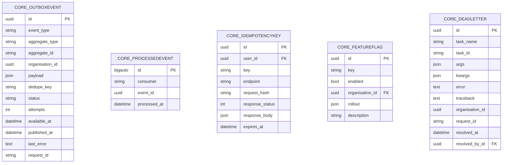
```mermaid
erDiagram
    CORE_OUTBOXEVENT {
        uuid id PK
        string event_type
        string aggregate_type
        string aggregate_id
        uuid organisation_id
        json payload
        string dedupe_key
        string status
        int attempts
        datetime available_at
        datetime published_at
        text last_error
        string request_id
    }
    CORE_PROCESSEDEVENT {
        bigauto id PK
        string consumer
        uuid event_id
        datetime processed_at
    }
    CORE_IDEMPOTENCYKEY {
        uuid id PK
        uuid user_id FK
        string key
        string endpoint
        string request_hash
        int response_status
        json response_body
        datetime expires_at
    }
    CORE_FEATUREFLAG {
        uuid id PK
        string key
        bool enabled
        uuid organisation_id FK
        json rollout
        string description
    }
    CORE_DEADLETTER {
        uuid id PK
        string task_name
        string task_id
        json args
        json kwargs
        text error
        text traceback
        uuid organisation_id
        string request_id
        datetime resolved_at
        uuid resolved_by_id FK
    }
```

## Documents (`documents`)

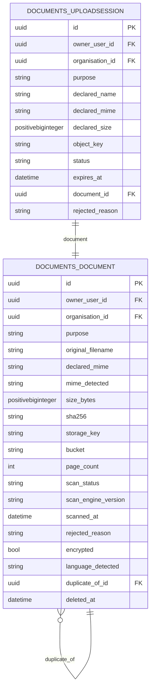
```mermaid
erDiagram
    DOCUMENTS_UPLOADSESSION {
        uuid id PK
        uuid owner_user_id FK
        uuid organisation_id FK
        string purpose
        string declared_name
        string declared_mime
        positivebiginteger declared_size
        string object_key
        string status
        datetime expires_at
        uuid document_id FK
        string rejected_reason
    }
    DOCUMENTS_DOCUMENT {
        uuid id PK
        uuid owner_user_id FK
        uuid organisation_id FK
        string purpose
        string original_filename
        string declared_mime
        string mime_detected
        positivebiginteger size_bytes
        string sha256
        string storage_key
        string bucket
        int page_count
        string scan_status
        string scan_engine_version
        datetime scanned_at
        string rejected_reason
        bool encrypted
        string language_detected
        uuid duplicate_of_id FK
        datetime deleted_at
    }
    DOCUMENTS_UPLOADSESSION ||--|| DOCUMENTS_DOCUMENT : "document"
    DOCUMENTS_DOCUMENT }o--|| DOCUMENTS_DOCUMENT : "duplicate_of"
```

## External integrations (`integrations`)

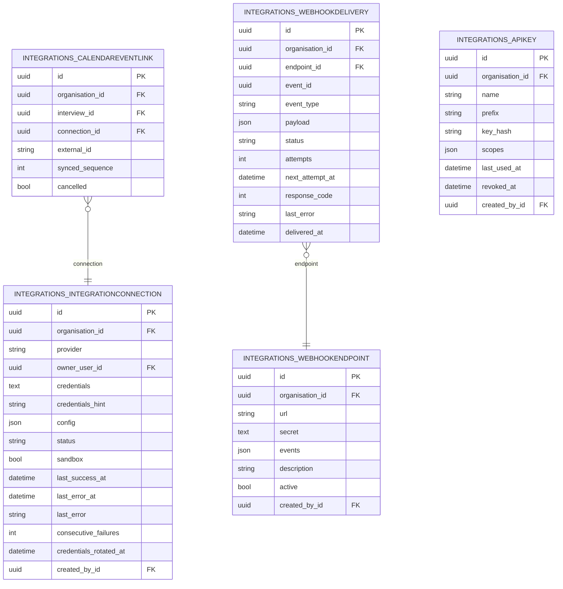
```mermaid
erDiagram
    INTEGRATIONS_INTEGRATIONCONNECTION {
        uuid id PK
        uuid organisation_id FK
        string provider
        uuid owner_user_id FK
        text credentials
        string credentials_hint
        json config
        string status
        bool sandbox
        datetime last_success_at
        datetime last_error_at
        string last_error
        int consecutive_failures
        datetime credentials_rotated_at
        uuid created_by_id FK
    }
    INTEGRATIONS_CALENDAREVENTLINK {
        uuid id PK
        uuid organisation_id FK
        uuid interview_id FK
        uuid connection_id FK
        string external_id
        int synced_sequence
        bool cancelled
    }
    INTEGRATIONS_WEBHOOKENDPOINT {
        uuid id PK
        uuid organisation_id FK
        string url
        text secret
        json events
        string description
        bool active
        uuid created_by_id FK
    }
    INTEGRATIONS_WEBHOOKDELIVERY {
        uuid id PK
        uuid organisation_id FK
        uuid endpoint_id FK
        uuid event_id
        string event_type
        json payload
        string status
        int attempts
        datetime next_attempt_at
        int response_code
        string last_error
        datetime delivered_at
    }
    INTEGRATIONS_APIKEY {
        uuid id PK
        uuid organisation_id FK
        string name
        string prefix
        string key_hash
        json scopes
        datetime last_used_at
        datetime revoked_at
        uuid created_by_id FK
    }
    INTEGRATIONS_CALENDAREVENTLINK }o--|| INTEGRATIONS_INTEGRATIONCONNECTION : "connection"
    INTEGRATIONS_WEBHOOKDELIVERY }o--|| INTEGRATIONS_WEBHOOKENDPOINT : "endpoint"
```

## Interviews (`interviews`)

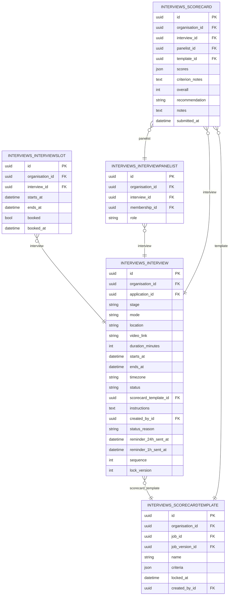
```mermaid
erDiagram
    INTERVIEWS_SCORECARDTEMPLATE {
        uuid id PK
        uuid organisation_id FK
        uuid job_id FK
        uuid job_version_id FK
        string name
        json criteria
        datetime locked_at
        uuid created_by_id FK
    }
    INTERVIEWS_INTERVIEW {
        uuid id PK
        uuid organisation_id FK
        uuid application_id FK
        string stage
        string mode
        string location
        string video_link
        int duration_minutes
        datetime starts_at
        datetime ends_at
        string timezone
        string status
        uuid scorecard_template_id FK
        text instructions
        uuid created_by_id FK
        string status_reason
        datetime reminder_24h_sent_at
        datetime reminder_1h_sent_at
        int sequence
        int lock_version
    }
    INTERVIEWS_INTERVIEWSLOT {
        uuid id PK
        uuid organisation_id FK
        uuid interview_id FK
        datetime starts_at
        datetime ends_at
        bool booked
        datetime booked_at
    }
    INTERVIEWS_INTERVIEWPANELIST {
        uuid id PK
        uuid organisation_id FK
        uuid interview_id FK
        uuid membership_id FK
        string role
    }
    INTERVIEWS_SCORECARD {
        uuid id PK
        uuid organisation_id FK
        uuid interview_id FK
        uuid panelist_id FK
        uuid template_id FK
        json scores
        text criterion_notes
        int overall
        string recommendation
        text notes
        datetime submitted_at
    }
    INTERVIEWS_INTERVIEW }o--|| INTERVIEWS_SCORECARDTEMPLATE : "scorecard_template"
    INTERVIEWS_INTERVIEWSLOT }o--|| INTERVIEWS_INTERVIEW : "interview"
    INTERVIEWS_INTERVIEWPANELIST }o--|| INTERVIEWS_INTERVIEW : "interview"
    INTERVIEWS_SCORECARD }o--|| INTERVIEWS_INTERVIEW : "interview"
    INTERVIEWS_SCORECARD }o--|| INTERVIEWS_INTERVIEWPANELIST : "panelist"
    INTERVIEWS_SCORECARD }o--|| INTERVIEWS_SCORECARDTEMPLATE : "template"
```

## Vacancies (`jobs`)

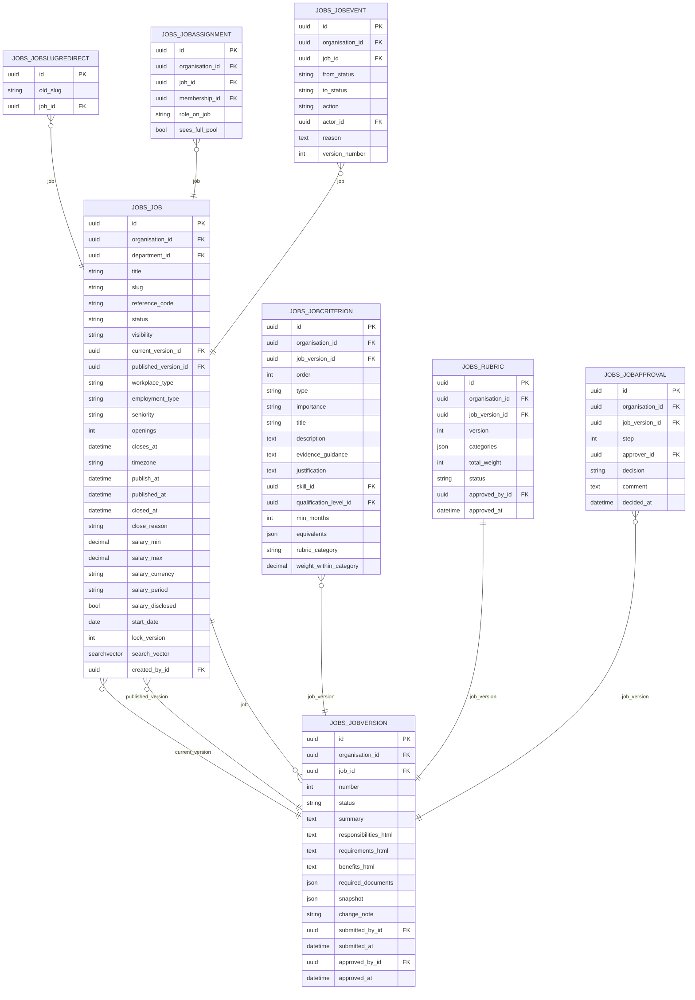
```mermaid
erDiagram
    JOBS_JOB {
        uuid id PK
        uuid organisation_id FK
        uuid department_id FK
        string title
        string slug
        string reference_code
        string status
        string visibility
        uuid current_version_id FK
        uuid published_version_id FK
        string workplace_type
        string employment_type
        string seniority
        int openings
        datetime closes_at
        string timezone
        datetime publish_at
        datetime published_at
        datetime closed_at
        string close_reason
        decimal salary_min
        decimal salary_max
        string salary_currency
        string salary_period
        bool salary_disclosed
        date start_date
        int lock_version
        searchvector search_vector
        uuid created_by_id FK
    }
    JOBS_JOBSLUGREDIRECT {
        uuid id PK
        string old_slug
        uuid job_id FK
    }
    JOBS_JOBVERSION {
        uuid id PK
        uuid organisation_id FK
        uuid job_id FK
        int number
        string status
        text summary
        text responsibilities_html
        text requirements_html
        text benefits_html
        json required_documents
        json snapshot
        string change_note
        uuid submitted_by_id FK
        datetime submitted_at
        uuid approved_by_id FK
        datetime approved_at
    }
    JOBS_JOBCRITERION {
        uuid id PK
        uuid organisation_id FK
        uuid job_version_id FK
        int order
        string type
        string importance
        string title
        text description
        text evidence_guidance
        text justification
        uuid skill_id FK
        uuid qualification_level_id FK
        int min_months
        json equivalents
        string rubric_category
        decimal weight_within_category
    }
    JOBS_RUBRIC {
        uuid id PK
        uuid organisation_id FK
        uuid job_version_id FK
        int version
        json categories
        int total_weight
        string status
        uuid approved_by_id FK
        datetime approved_at
    }
    JOBS_JOBAPPROVAL {
        uuid id PK
        uuid organisation_id FK
        uuid job_version_id FK
        int step
        uuid approver_id FK
        string decision
        text comment
        datetime decided_at
    }
    JOBS_JOBASSIGNMENT {
        uuid id PK
        uuid organisation_id FK
        uuid job_id FK
        uuid membership_id FK
        string role_on_job
        bool sees_full_pool
    }
    JOBS_JOBEVENT {
        uuid id PK
        uuid organisation_id FK
        uuid job_id FK
        string from_status
        string to_status
        string action
        uuid actor_id FK
        text reason
        int version_number
    }
    JOBS_JOB }o--|| JOBS_JOBVERSION : "current_version"
    JOBS_JOB }o--|| JOBS_JOBVERSION : "published_version"
    JOBS_JOBSLUGREDIRECT }o--|| JOBS_JOB : "job"
    JOBS_JOBVERSION }o--|| JOBS_JOB : "job"
    JOBS_JOBCRITERION }o--|| JOBS_JOBVERSION : "job_version"
    JOBS_RUBRIC ||--|| JOBS_JOBVERSION : "job_version"
    JOBS_JOBAPPROVAL }o--|| JOBS_JOBVERSION : "job_version"
    JOBS_JOBASSIGNMENT }o--|| JOBS_JOB : "job"
    JOBS_JOBEVENT }o--|| JOBS_JOB : "job"
```

## Clarifications & messages (`messaging`)

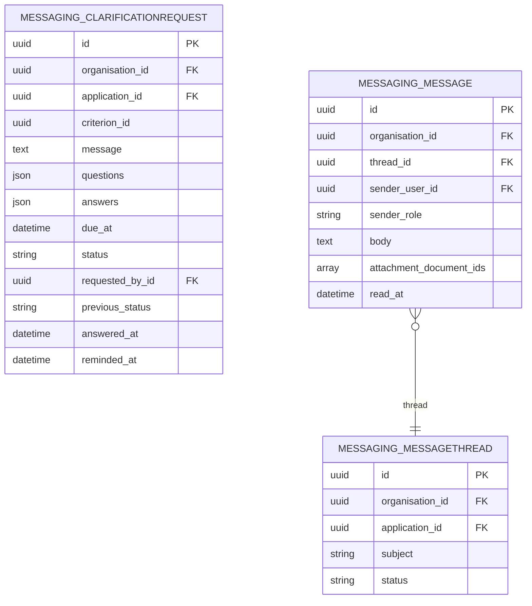
```mermaid
erDiagram
    MESSAGING_CLARIFICATIONREQUEST {
        uuid id PK
        uuid organisation_id FK
        uuid application_id FK
        uuid criterion_id
        text message
        json questions
        json answers
        datetime due_at
        string status
        uuid requested_by_id FK
        string previous_status
        datetime answered_at
        datetime reminded_at
    }
    MESSAGING_MESSAGETHREAD {
        uuid id PK
        uuid organisation_id FK
        uuid application_id FK
        string subject
        string status
    }
    MESSAGING_MESSAGE {
        uuid id PK
        uuid organisation_id FK
        uuid thread_id FK
        uuid sender_user_id FK
        string sender_role
        text body
        array attachment_document_ids
        datetime read_at
    }
    MESSAGING_MESSAGE }o--|| MESSAGING_MESSAGETHREAD : "thread"
```

## Notifications (`notifications`)

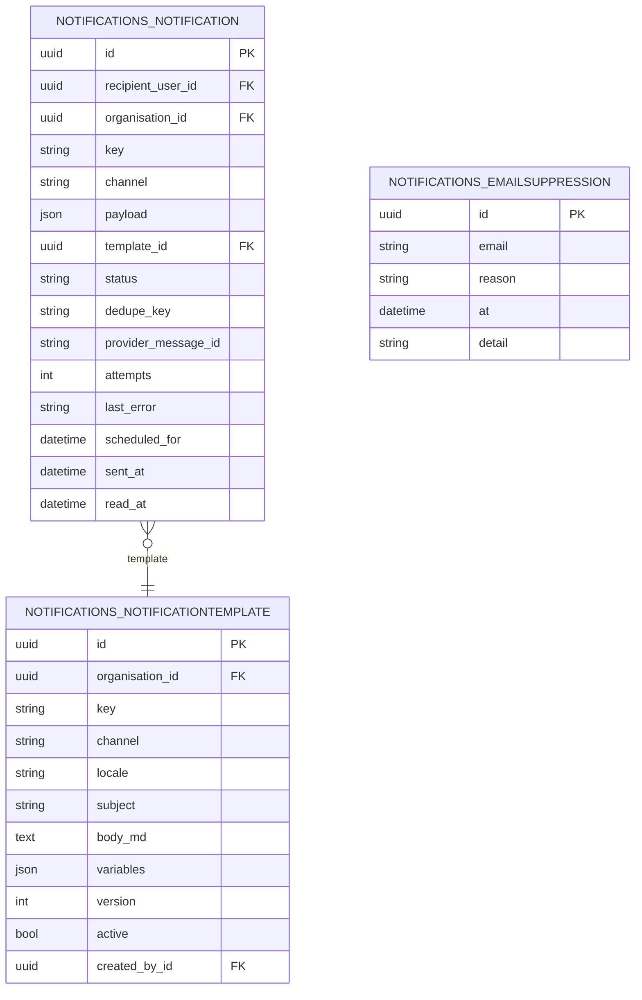
```mermaid
erDiagram
    NOTIFICATIONS_NOTIFICATIONTEMPLATE {
        uuid id PK
        uuid organisation_id FK
        string key
        string channel
        string locale
        string subject
        text body_md
        json variables
        int version
        bool active
        uuid created_by_id FK
    }
    NOTIFICATIONS_NOTIFICATION {
        uuid id PK
        uuid recipient_user_id FK
        uuid organisation_id FK
        string key
        string channel
        json payload
        uuid template_id FK
        string status
        string dedupe_key
        string provider_message_id
        int attempts
        string last_error
        datetime scheduled_for
        datetime sent_at
        datetime read_at
    }
    NOTIFICATIONS_EMAILSUPPRESSION {
        uuid id PK
        string email
        string reason
        datetime at
        string detail
    }
    NOTIFICATIONS_NOTIFICATION }o--|| NOTIFICATIONS_NOTIFICATIONTEMPLATE : "template"
```

## Offers and hiring (`offers`)

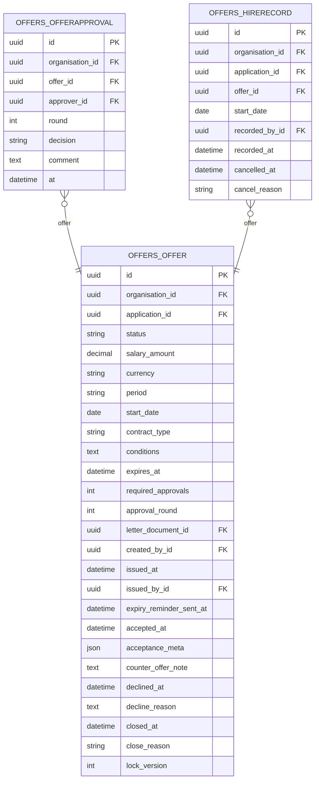
```mermaid
erDiagram
    OFFERS_OFFER {
        uuid id PK
        uuid organisation_id FK
        uuid application_id FK
        string status
        decimal salary_amount
        string currency
        string period
        date start_date
        string contract_type
        text conditions
        datetime expires_at
        int required_approvals
        int approval_round
        uuid letter_document_id FK
        uuid created_by_id FK
        datetime issued_at
        uuid issued_by_id FK
        datetime expiry_reminder_sent_at
        datetime accepted_at
        json acceptance_meta
        text counter_offer_note
        datetime declined_at
        text decline_reason
        datetime closed_at
        string close_reason
        int lock_version
    }
    OFFERS_OFFERAPPROVAL {
        uuid id PK
        uuid organisation_id FK
        uuid offer_id FK
        uuid approver_id FK
        int round
        string decision
        text comment
        datetime at
    }
    OFFERS_HIRERECORD {
        uuid id PK
        uuid organisation_id FK
        uuid application_id FK
        uuid offer_id FK
        date start_date
        uuid recorded_by_id FK
        datetime recorded_at
        datetime cancelled_at
        string cancel_reason
    }
    OFFERS_OFFERAPPROVAL }o--|| OFFERS_OFFER : "offer"
    OFFERS_HIRERECORD }o--|| OFFERS_OFFER : "offer"
```

## Organisations (`organisations`)

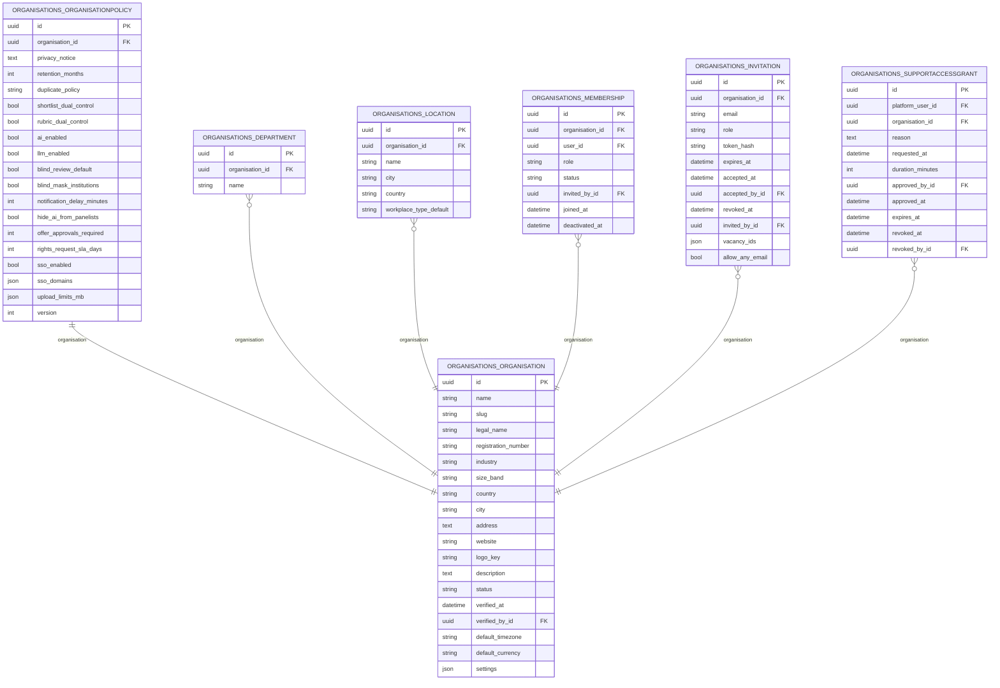
```mermaid
erDiagram
    ORGANISATIONS_ORGANISATION {
        uuid id PK
        string name
        string slug
        string legal_name
        string registration_number
        string industry
        string size_band
        string country
        string city
        text address
        string website
        string logo_key
        text description
        string status
        datetime verified_at
        uuid verified_by_id FK
        string default_timezone
        string default_currency
        json settings
    }
    ORGANISATIONS_ORGANISATIONPOLICY {
        uuid id PK
        uuid organisation_id FK
        text privacy_notice
        int retention_months
        string duplicate_policy
        bool shortlist_dual_control
        bool rubric_dual_control
        bool ai_enabled
        bool llm_enabled
        bool blind_review_default
        bool blind_mask_institutions
        int notification_delay_minutes
        bool hide_ai_from_panelists
        int offer_approvals_required
        int rights_request_sla_days
        bool sso_enabled
        json sso_domains
        json upload_limits_mb
        int version
    }
    ORGANISATIONS_DEPARTMENT {
        uuid id PK
        uuid organisation_id FK
        string name
    }
    ORGANISATIONS_LOCATION {
        uuid id PK
        uuid organisation_id FK
        string name
        string city
        string country
        string workplace_type_default
    }
    ORGANISATIONS_MEMBERSHIP {
        uuid id PK
        uuid organisation_id FK
        uuid user_id FK
        string role
        string status
        uuid invited_by_id FK
        datetime joined_at
        datetime deactivated_at
    }
    ORGANISATIONS_INVITATION {
        uuid id PK
        uuid organisation_id FK
        string email
        string role
        string token_hash
        datetime expires_at
        datetime accepted_at
        uuid accepted_by_id FK
        datetime revoked_at
        uuid invited_by_id FK
        json vacancy_ids
        bool allow_any_email
    }
    ORGANISATIONS_SUPPORTACCESSGRANT {
        uuid id PK
        uuid platform_user_id FK
        uuid organisation_id FK
        text reason
        datetime requested_at
        int duration_minutes
        uuid approved_by_id FK
        datetime approved_at
        datetime expires_at
        datetime revoked_at
        uuid revoked_by_id FK
    }
    ORGANISATIONS_ORGANISATIONPOLICY ||--|| ORGANISATIONS_ORGANISATION : "organisation"
    ORGANISATIONS_DEPARTMENT }o--|| ORGANISATIONS_ORGANISATION : "organisation"
    ORGANISATIONS_LOCATION }o--|| ORGANISATIONS_ORGANISATION : "organisation"
    ORGANISATIONS_MEMBERSHIP }o--|| ORGANISATIONS_ORGANISATION : "organisation"
    ORGANISATIONS_INVITATION }o--|| ORGANISATIONS_ORGANISATION : "organisation"
    ORGANISATIONS_SUPPORTACCESSGRANT }o--|| ORGANISATIONS_ORGANISATION : "organisation"
```

## Privacy & consent (`privacy`)

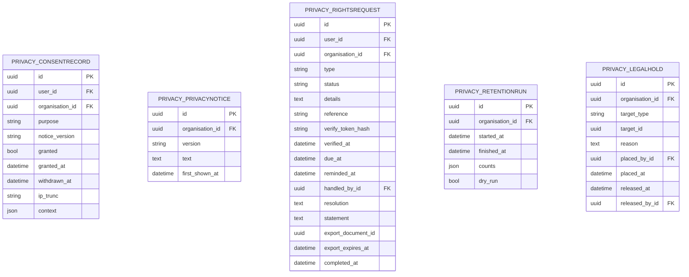
```mermaid
erDiagram
    PRIVACY_CONSENTRECORD {
        uuid id PK
        uuid user_id FK
        uuid organisation_id FK
        string purpose
        string notice_version
        bool granted
        datetime granted_at
        datetime withdrawn_at
        string ip_trunc
        json context
    }
    PRIVACY_PRIVACYNOTICE {
        uuid id PK
        uuid organisation_id FK
        string version
        text text
        datetime first_shown_at
    }
    PRIVACY_RIGHTSREQUEST {
        uuid id PK
        uuid user_id FK
        uuid organisation_id FK
        string type
        string status
        text details
        string reference
        string verify_token_hash
        datetime verified_at
        datetime due_at
        datetime reminded_at
        uuid handled_by_id FK
        text resolution
        text statement
        uuid export_document_id
        datetime export_expires_at
        datetime completed_at
    }
    PRIVACY_RETENTIONRUN {
        uuid id PK
        uuid organisation_id FK
        datetime started_at
        datetime finished_at
        json counts
        bool dry_run
    }
    PRIVACY_LEGALHOLD {
        uuid id PK
        uuid organisation_id FK
        string target_type
        uuid target_id
        text reason
        uuid placed_by_id FK
        datetime placed_at
        datetime released_at
        uuid released_by_id FK
    }
```

## Screening questionnaires (`questionnaires`)

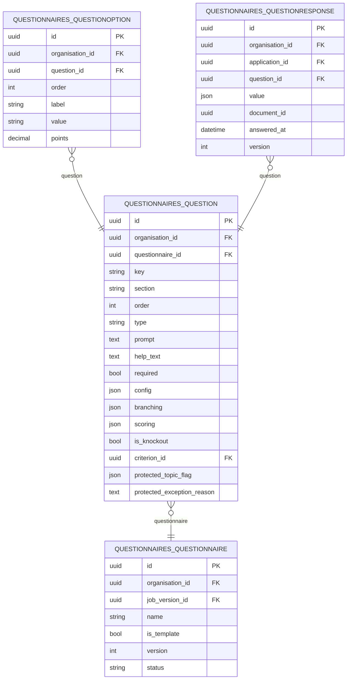
```mermaid
erDiagram
    QUESTIONNAIRES_QUESTIONNAIRE {
        uuid id PK
        uuid organisation_id FK
        uuid job_version_id FK
        string name
        bool is_template
        int version
        string status
    }
    QUESTIONNAIRES_QUESTION {
        uuid id PK
        uuid organisation_id FK
        uuid questionnaire_id FK
        string key
        string section
        int order
        string type
        text prompt
        text help_text
        bool required
        json config
        json branching
        json scoring
        bool is_knockout
        uuid criterion_id FK
        json protected_topic_flag
        text protected_exception_reason
    }
    QUESTIONNAIRES_QUESTIONOPTION {
        uuid id PK
        uuid organisation_id FK
        uuid question_id FK
        int order
        string label
        string value
        decimal points
    }
    QUESTIONNAIRES_QUESTIONRESPONSE {
        uuid id PK
        uuid organisation_id FK
        uuid application_id FK
        uuid question_id FK
        json value
        uuid document_id
        datetime answered_at
        int version
    }
    QUESTIONNAIRES_QUESTION }o--|| QUESTIONNAIRES_QUESTIONNAIRE : "questionnaire"
    QUESTIONNAIRES_QUESTIONOPTION }o--|| QUESTIONNAIRES_QUESTION : "question"
    QUESTIONNAIRES_QUESTIONRESPONSE }o--|| QUESTIONNAIRES_QUESTION : "question"
```

## CV extraction (`resumes`)

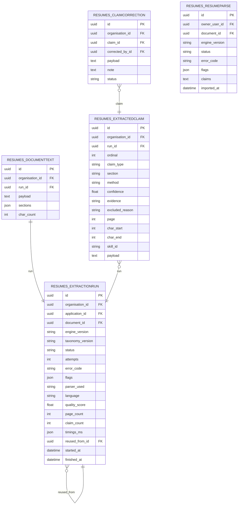
```mermaid
erDiagram
    RESUMES_EXTRACTIONRUN {
        uuid id PK
        uuid organisation_id FK
        uuid application_id FK
        uuid document_id FK
        string engine_version
        string taxonomy_version
        string status
        int attempts
        string error_code
        json flags
        string parser_used
        string language
        float quality_score
        int page_count
        int claim_count
        json timings_ms
        uuid reused_from_id FK
        datetime started_at
        datetime finished_at
    }
    RESUMES_DOCUMENTTEXT {
        uuid id PK
        uuid organisation_id FK
        uuid run_id FK
        text payload
        json sections
        int char_count
    }
    RESUMES_EXTRACTEDCLAIM {
        uuid id PK
        uuid organisation_id FK
        uuid run_id FK
        int ordinal
        string claim_type
        string section
        string method
        float confidence
        string evidence
        string excluded_reason
        int page
        int char_start
        int char_end
        string skill_id
        text payload
    }
    RESUMES_CLAIMCORRECTION {
        uuid id PK
        uuid organisation_id FK
        uuid claim_id FK
        uuid corrected_by_id FK
        text payload
        text note
        string status
    }
    RESUMES_RESUMEPARSE {
        uuid id PK
        uuid owner_user_id FK
        uuid document_id FK
        string engine_version
        string status
        string error_code
        json flags
        text claims
        datetime imported_at
    }
    RESUMES_EXTRACTIONRUN }o--|| RESUMES_EXTRACTIONRUN : "reused_from"
    RESUMES_DOCUMENTTEXT ||--|| RESUMES_EXTRACTIONRUN : "run"
    RESUMES_EXTRACTEDCLAIM }o--|| RESUMES_EXTRACTIONRUN : "run"
    RESUMES_CLAIMCORRECTION }o--|| RESUMES_EXTRACTEDCLAIM : "claim"
```

## Screening (`screening`)

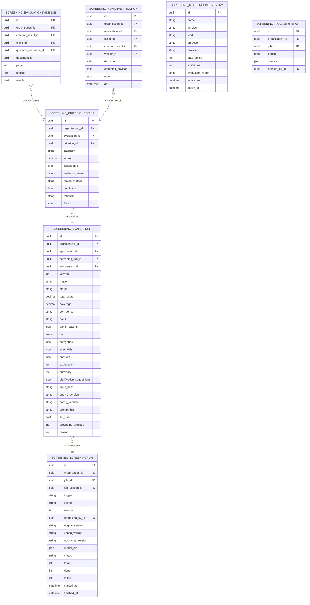
```mermaid
erDiagram
    SCREENING_SCREENINGRUN {
        uuid id PK
        uuid organisation_id FK
        uuid job_id FK
        uuid job_version_id FK
        string trigger
        string scope
        text reason
        uuid requested_by_id FK
        string engine_version
        string config_version
        string taxonomy_version
        json model_ids
        string status
        int total
        int done
        int failed
        datetime started_at
        datetime finished_at
    }
    SCREENING_EVALUATION {
        uuid id PK
        uuid organisation_id FK
        uuid application_id FK
        uuid screening_run_id FK
        uuid job_version_id FK
        int version
        string trigger
        string status
        decimal total_score
        decimal coverage
        string confidence
        string band
        json band_reasons
        array flags
        json categories
        json essentials
        json conflicts
        text explanation
        text summary
        json clarification_suggestions
        string input_hash
        string engine_version
        string config_version
        string prompt_hash
        bool llm_used
        int grounding_dropped
        text reason
    }
    SCREENING_CRITERIONRESULT {
        uuid id PK
        uuid organisation_id FK
        uuid evaluation_id FK
        uuid criterion_id FK
        string category
        decimal score
        bool assessable
        string evidence_status
        string match_method
        float confidence
        string rationale
        json flags
    }
    SCREENING_EVALUATIONEVIDENCE {
        uuid id PK
        uuid organisation_id FK
        uuid criterion_result_id FK
        uuid claim_id FK
        uuid question_response_id FK
        uuid document_id
        int page
        text snippet
        float weight
    }
    SCREENING_HUMANVERIFICATION {
        uuid id PK
        uuid organisation_id FK
        uuid application_id FK
        uuid claim_id FK
        uuid criterion_result_id FK
        uuid verifier_id FK
        string decision
        text corrected_payload
        text note
        datetime at
    }
    SCREENING_MODELREGISTRYENTRY {
        uuid id PK
        string name
        string version
        string kind
        string purpose
        string provider
        text data_policy
        text limitations
        string evaluation_report
        datetime active_from
        datetime active_to
    }
    SCREENING_AIQUALITYREPORT {
        uuid id PK
        uuid organisation_id FK
        uuid job_id FK
        date period
        json metrics
        uuid created_by_id FK
    }
    SCREENING_EVALUATION }o--|| SCREENING_SCREENINGRUN : "screening_run"
    SCREENING_CRITERIONRESULT }o--|| SCREENING_EVALUATION : "evaluation"
    SCREENING_EVALUATIONEVIDENCE }o--|| SCREENING_CRITERIONRESULT : "criterion_result"
    SCREENING_HUMANVERIFICATION }o--|| SCREENING_CRITERIONRESULT : "criterion_result"
```

## Shortlisting (`shortlisting`)

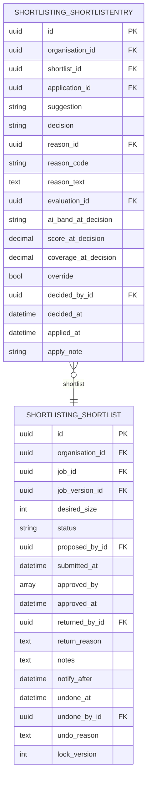
```mermaid
erDiagram
    SHORTLISTING_SHORTLIST {
        uuid id PK
        uuid organisation_id FK
        uuid job_id FK
        uuid job_version_id FK
        int desired_size
        string status
        uuid proposed_by_id FK
        datetime submitted_at
        array approved_by
        datetime approved_at
        uuid returned_by_id FK
        text return_reason
        text notes
        datetime notify_after
        datetime undone_at
        uuid undone_by_id FK
        text undo_reason
        int lock_version
    }
    SHORTLISTING_SHORTLISTENTRY {
        uuid id PK
        uuid organisation_id FK
        uuid shortlist_id FK
        uuid application_id FK
        string suggestion
        string decision
        uuid reason_id FK
        string reason_code
        text reason_text
        uuid evaluation_id FK
        string ai_band_at_decision
        decimal score_at_decision
        decimal coverage_at_decision
        bool override
        uuid decided_by_id FK
        datetime decided_at
        datetime applied_at
        string apply_note
    }
    SHORTLISTING_SHORTLISTENTRY }o--|| SHORTLISTING_SHORTLIST : "shortlist"
```

## Talent pool (`talentpool`)

```mermaid
erDiagram
    TALENTPOOL_TALENTPOOLENTRY {
        uuid id PK
        uuid organisation_id FK
        uuid candidate_user_id FK
        uuid consent_record_id FK
        uuid source_application_id FK
        string status
        datetime joined_at
        datetime expires_at
        datetime reconfirmed_at
        datetime reminder_sent_at
        datetime left_at
        json tags
    }
    TALENTPOOL_TALENTPOOLINVITE {
        uuid id PK
        uuid organisation_id FK
        uuid entry_id FK
        uuid job_id FK
        uuid invited_by_id FK
        datetime invited_at
    }
    TALENTPOOL_TALENTPOOLINVITE }o--|| TALENTPOOL_TALENTPOOLENTRY : "entry"
```

## Skills & qualifications taxonomy (`taxonomy`)

```mermaid
erDiagram
    TAXONOMY_TAXONOMYVERSION {
        uuid id PK
        string version
        text notes
        string checksum
        datetime published_at
    }
    TAXONOMY_SKILL {
        uuid id PK
        string taxonomy_version
        string canonical_name
        string slug
        string category
        text description
        vector embedding
        string embedding_model
        bool is_active
        uuid organisation_id FK
    }
    TAXONOMY_SKILLALIAS {
        uuid id PK
        uuid skill_id FK
        string alias
        uuid organisation_id FK
    }
    TAXONOMY_SKILLRELATION {
        uuid id PK
        uuid from_skill_id FK
        uuid to_skill_id FK
        string relation
        float weight
    }
    TAXONOMY_QUALIFICATIONLEVEL {
        uuid id PK
        string code
        string name
        int rank
        string framework
        text description
    }
    TAXONOMY_QUALIFICATIONALIAS {
        uuid id PK
        uuid level_id FK
        string alias
    }
    TAXONOMY_PROFESSIONALBODY {
        uuid id PK
        string code
        string name
        string country
        json designations
    }
    TAXONOMY_SKILLALIAS }o--|| TAXONOMY_SKILL : "skill"
    TAXONOMY_SKILLRELATION }o--|| TAXONOMY_SKILL : "from_skill"
    TAXONOMY_SKILLRELATION }o--|| TAXONOMY_SKILL : "to_skill"
    TAXONOMY_QUALIFICATIONALIAS }o--|| TAXONOMY_QUALIFICATIONLEVEL : "level"
```
